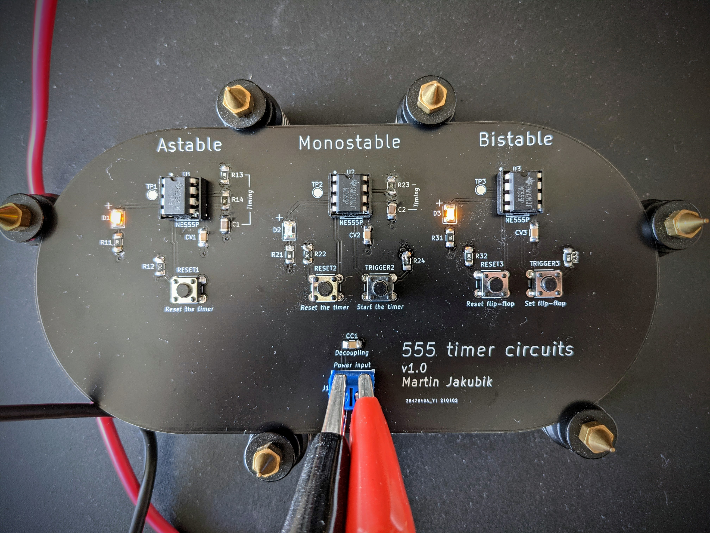
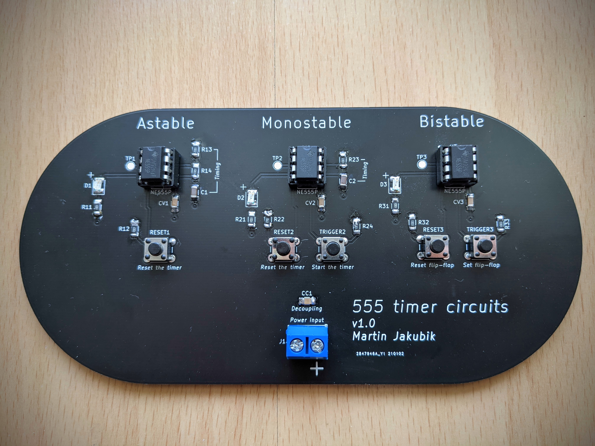
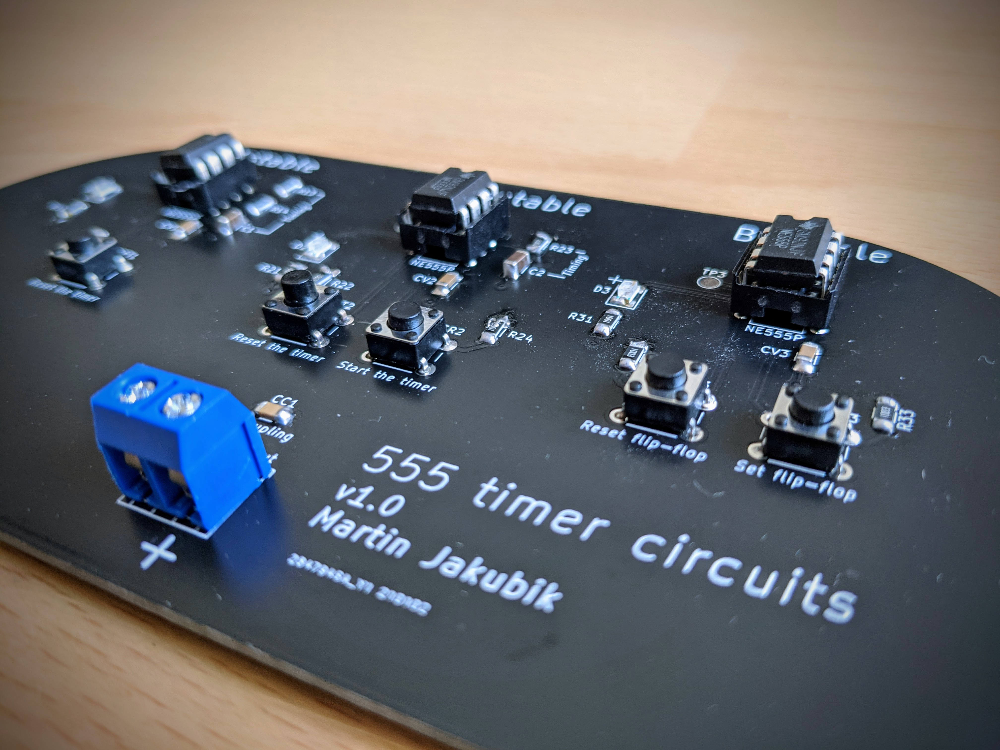

# 555-circuits

A PCB design with the three most common 555 timer circuits - astable, monostable, bistable. Included in the repo are KiCad project files, the circuit and PCB design.

Here's the 3D model of the circuit design:

After an evening of soldering, here's the finished circuit board:

